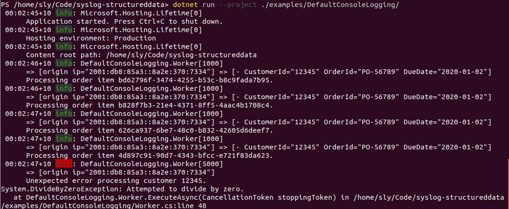
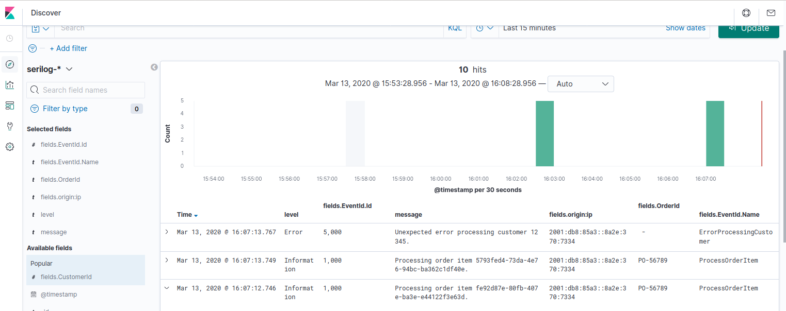
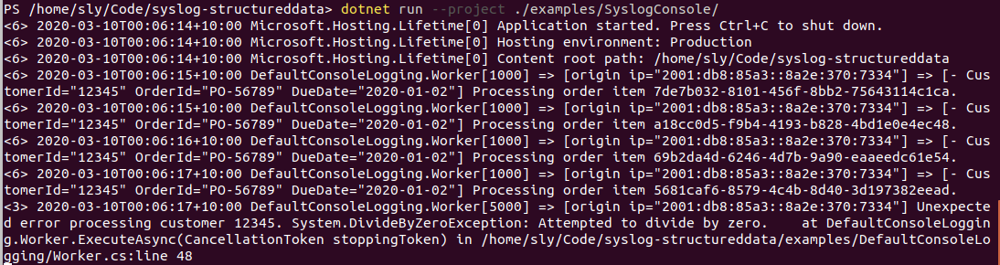

# Syslog Structured Data

Logging element for .NET that will render as syslog RFC 5424 structured data, for use in Microsoft.Extensions.Logging and other log systems.

## Getting started

To use the Syslog `StructuredData` component, install the [Syslog.StructuredData nuget package](https://www.nuget.org/packages/Syslog.StructuredData):

```powershell
dotnet add package Syslog.StructuredData
```

You can then use the structured data via `BeginScope()` on an `ILogger`: 

```c#
using (_logger.BeginScope(new StructuredData
{
    ["CustomerId"] = customerId, ["OrderId"] = orderId, ["DueDate"] = dueDate
}))
{
    // ...
}
```

### Output: basic logger providers

For default logger providers, that don't understand structured data, the `ToString()` method on the `StructuredData` object will render out the data in RFC 5424 format. This format can still be easily parsed by log analyzers, although the surrounding context won't be a syslog message.

**Example output: Using the default console logger, with scopes and timestamp**



### Output: loggers that support structured data

For logger providers that do understand structured data, the `StructuredData` class implements the `IReadOnlyList<KeyValuePair<string, object>>` interface to be compatible with `FormattedLogValues`, allowing individual structured parameters to be extracted and logged as individual fields.

For data with a specified SD-ID the value is prefixed to the parameter names, e.g. "origin:ip", and the SD-ID value is included with the name `StructuredData.IdKey` ("SD-ID").

**Example output: Using Elasticsearch and Kibana** 



**Example output: Using Seq** 


### Other constructors and overloads

The `StructuredData` class supports collection initializers for the parameter values, which can be used at the same time as the `Id` property initializer for a compact representation.

```c#
using (_logger.BeginScope(new StructuredData
{
    Id = "origin", ["ip"] = ipAddress
}))
{
    // ...
}
```

An overload of `BeginScope()` extension method is also provided:

```c#
            using (_logger.BeginScope("userevent@-",
                new Dictionary<string, object> {["UserId"] = userId, ["EventId"] = eventId}))
            {
    // ...
}
```


## Examples

Several examples are provided.

These can easily be run from the command line:

```powershell
dotnet run --project ./examples/DefaultConsoleLogging
```

Or using the console 'Systemd' format:

```powershell
dotnet run --project ./examples/SyslogLogging
```

**Example output: Console 'Systemd' format** 



Provided [examples](examples/):

* Default consoler logger provider
* Console logger with Systemd format
* [Seq server](examples/SeqLogging)
* [ELK stack](examples/ElkStack)
* Example using the BeginScope() extension method

## Development

The `StructuredData` class is available from .NET Standard 1.1 or higher. It runs across all platforms where .NET is supported. You need the dotnet SDK for development.


### Packaging

To create a local package, run the following. You will then need to update the references in the examples.

```powershell
dotnet pack src/Syslog.StructuredData --output pack
```

Versioning uses GitVersion, based on the git branch, using Mainline mode; if you are testing multiple local versions you may need to clean your nuget cache to ensure you are referencing the latest build.


### To do list

* Provide a formatter for FormattedLogValues / IReadOnlyList<KeyValuePair<string, object>> that will extract parameters, look for SD-ID, remove any prefixes, and render RFC 5424 format. Needed to support other scope values (can also provide an overload that wraps an object to [- scope="..."])

* Add StructuredDataExtensions for FromFormattedLogValues(), to basically do as above.

* Add StructuredDataExtensions for ToFormattedLogValues(), that builds an RFC 5424 `format` (including prefixed names; note that simple values will work but complex ones, e.g. strings with invalid characters, won't be escaped correctly).

* Add support for customFormat string, for better compatibility with FormattedLogValues, and use that in the default ToString(), i.e. an explicit override. Also provide an overload (IFormattable?) that forces RFC 5424 format.

* BeginScope overloads with customformat string.


## License

Copyright (C) 2020 Gryphon Technology Pty Ltd

This library is free software: you can redistribute it and/or modify it under the terms of the GNU Lesser General Public License as published by the Free Software Foundation, either version 3 of the License, or (at your option) any later version.

This library is distributed in the hope that it will be useful, but WITHOUT ANY WARRANTY; without even the implied warranty of MERCHANTABILITY or FITNESS FOR A PARTICULAR PURPOSE. See the GNU Lesser General Public License and GNU General Public License for more details.

You should have received a copy of the GNU Lesser General Public License and GNU General Public License along with this library. If not, see <https://www.gnu.org/licenses/>.
