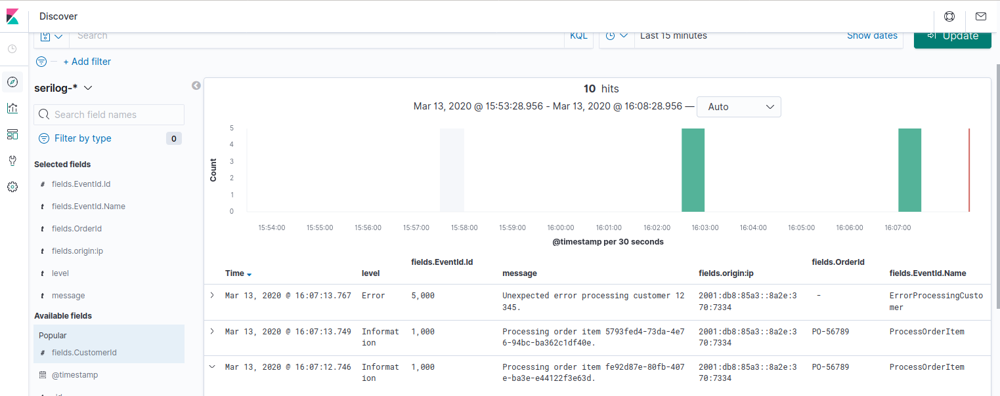

## Elasticsearch-Kibana (ELK) stack example

This example uses the Serilog provider for Microsoft.Extensions.Logging and Serilog sink to write directly to Elasticsearch (it doesn't use Logstash).

You need to be running an Elasticsearch and Kibana, for example on Linux a docker compose configuration is provided. There are a number of prerequesites that you will need to meet; the elk-docker project provides a good list, including some troubleshooting (see https://elk-docker.readthedocs.io/).

The provided Docker compose will create two nodes, one for Elasticsearch, and one for Kibana:

```powershell
sudo docker-compose -f examples/ElkStack/docker/docker-compose.yml up
```

Then in another console, run the ElkStack example:

```powershell
dotnet run --project ./examples/ElkStack
```

Open a browser to the Kibana application:

```
http://localhost:5601
```

You will be prompted to create a new index pattern, based on the received messages (if it says there are no log messages, you need to troubleshoot the issue).

Use the index pattern "serilog-*", which matches the events sent, use the time filter "@timestamp", and create the pattern.

On the Discover tab, you will see your log messages, with all parameters logged as individual fields. 

You can configure columns as needed, and search for specific fields (e.g. "fields.CustomerId: 12345").

**Example output: Kibana (from Serilog)** 



You can stop the container with `^C`. You can start it again, running in the background, with:

```powershell
sudo docker-compose -f examples/ElkStack/docker/docker-compose.yml start
```

### Other options for the ELK stack

The provided docker-compose file uses the open source images directly from Elastic, running one Elasticsearch node and one Kibana node, exposing the following ports:

* port 5601 - Kibana web interface
* port 9200 - Elasticsearch JSON interface

There is also a single contain ELK stack image, sebb/elk that can be used (https://elk-docker.readthedocs.io/)

This can also be run via docker compose, or directly:

```powershell
sudo docker pull sebp/elk
sudo docker run --ulimit nofile=65536:65536 -p 5601:5601 -p 9200:9200 -p 5044:5044 sebp/elk 
```

### Troubleshooting

Check ELK image:

```powershell
sudo docker image ls
```

Check ELK container:

```powershell
sudo docker container ls
```

Start a shell in container and check logstash plugins:

```powershell
sudo docker exec -it <container-id> /bin/bash
/opt/logstash/bin/logstash-plugin list
```

To manually create a dummy log entry and check it is working, run the following, then wait for logstash to start, then enter lines of text, e.g. "test log entry":

```powershell
sudo docker exec -it <container-id> /bin/bash
/opt/logstash/bin/logstash --path.data /tmp/logstash/data -e 'input { stdin { } } output { elasticsearch { hosts => ["localhost"] } }'
```

Check Elasticsearch directly (use `q=<search-text>` to search for specific entries):

```
http://localhost:9200/_search?pretty&q=test
```

