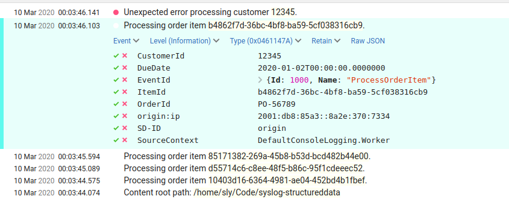

## Seq example

Seq supports structured data (semantic logging), so individual parameter values
will be logged (and can be queried, etc).

The SD-ID, if specified, will be prepended to the parameter names, so they are grouped
in the Seq server, for example with SD-ID "origin", the parameter "ip" is logged
in Seq as "origin:ip".

For the Seq example, you need to be running Seq. e.g. install on Windows, 
or on Linux open a terminal and run a docker image:

```powershell
sudo docker run -e ACCEPT_EULA=Y -p 5341:80 datalust/seq:latest
```

Then in another console, run the Seq example:

```powershell
dotnet run --project ./examples/SeqLogging
```

Open a browser to the Seq web application:

```
http://localhost:5601
```

Individual structured data parameters are displayed in Seq, can be queried, etc: 

**Example output: Using Seq** 


